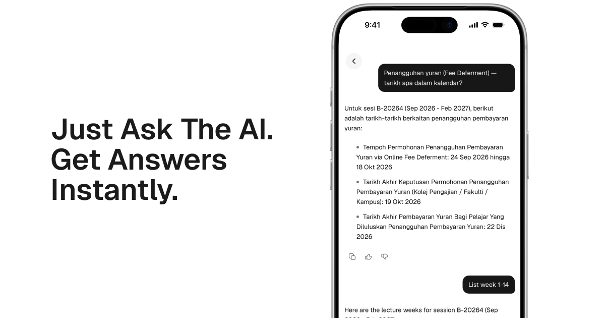
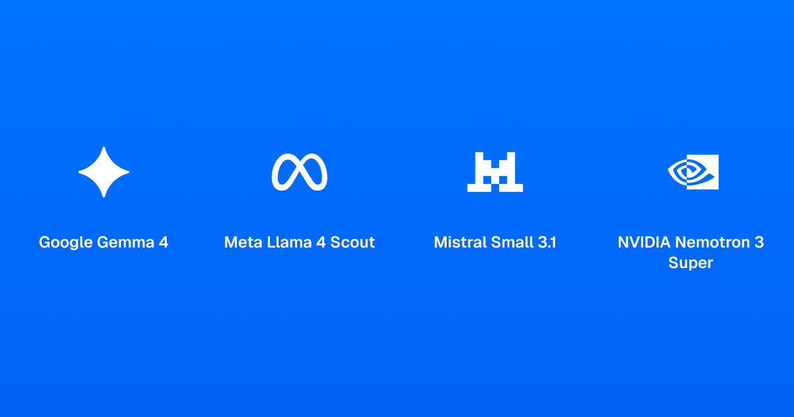

# Bila UiTM Cuti Chat

AI chat for UiTM academic calendar questions — ask in English or Malay and get clear, dated answers.

**Live:** [chat.bilauitmcuti.com](https://chat.bilauitmcuti.com) (also [bilauitmcuti.com/chat](https://bilauitmcuti.com/chat) on the main domain)

Part of [Bila UiTM Cuti](https://bilauitmcuti.com) — the companion chat (sometimes called **UiTM Assistant** / **AI Chat UiTM**) helps students check semester dates, lecture weeks, fee deferment windows, holidays, exams, and related UiTM info in a short conversation.

## What it does

Students often need a quick answer: *when is cuti semester?*, *what dates are fee deferment?*, *list week 1–14*, or *is today a holiday?* **Bila UiTM Cuti Chat** turns those questions into a streamed conversation, scoped to the user’s selected academic session and campus group when relevant.

The product stays focused on calendar and UiTM orientation questions. It is not a general-purpose chatbot for coursework, grades, or unofficial campus rumor.

## Models & capabilities

Users can pick a Cloudflare Workers AI model in the composer. All picker models support **function calling** (tool use).

The chat composer lets users pick from multiple Cloudflare Workers AI models, including Gemma 4 (default), Llama 4 Scout, Mistral Small 3.1, Nemotron 3 Super, and GLM 4.7 Flash. All available models support function calling, enabling the assistant to look up academic facts before answering.

Function calling lets the assistant look up the right academic facts before answering. Reasoning-capable models can show a short thinking/reasoning section in the chat UI for harder questions.

## Features

- Streaming chat UI for academic calendar and UiTM general questions
- Tool-calling agent with function calling across the model picker
- Reasoning UI for models that support it (Gemma 4, Nemotron 3 Super, GLM 4.7 Flash)
- Session / program scope picker so answers match the user’s campus group and semester
- Markdown replies (tables, code, math, diagrams where relevant)
- Cloudflare Turnstile bot protection on chat
- Optional thumbs feedback for product improvement
- Bilingual replies (English / Malay)
- Open Graph share card for social previews of the chat product

## Example questions

- Penangguhan yuran — tarikh apa dalam kalendar?
- List week 1–14 for my session
- Bila cuti semester / Mid-Semester Break?
- Tarikh peperiksaan akhir untuk sesi semasa?
- Public holiday this month (by state, when asked)

## Tech stack

| Area | Choice |
|------|--------|
| App | Next.js (App Router), React, TypeScript |
| UI | Tailwind CSS, shadcn/ui, Base UI |
| Runtime | Cloudflare Workers via `@opennextjs/cloudflare` |
| Inference | Cloudflare Workers AI + AI Gateway |
| Bot protection | Cloudflare Turnstile |
| Tests | Vitest |

## How chat works (high level)

1. The browser sends the question and receives a streamed reply.
2. Topic routing decides whether to run the tool-calling agent or a compact fallback.
3. Models with function calling may invoke tools, then draft an answer; reasoning-capable models can surface that step in the UI.
4. Replies are validated before they are shown.
5. Optional thumbs up/down help improve the product.

Runs in production on Cloudflare Workers at [chat.bilauitmcuti.com](https://chat.bilauitmcuti.com) (root `/`) and under [bilauitmcuti.com/chat](https://bilauitmcuti.com/chat) on the calendar domain. Apex DNS stays on Pages; only the `/chat*` path is routed to this Worker (never apex `/_next/*`).

## Related

- [Bila UiTM Cuti](https://bilauitmcuti.com) — calendar site

This repository is public for transparency. Contributions and write access are limited to collaborators. See [Contributing](CONTRIBUTING.md) and the [Code of Conduct](CODE_OF_CONDUCT.md).
